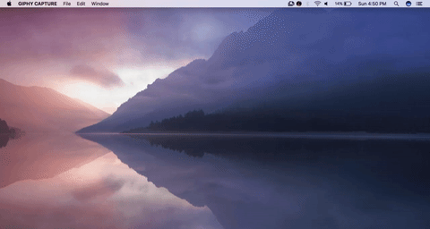

# LoL Status

'LoL Status' is an application that sits in your menubar and shows the status League of Legends services . All 11 regions  are supported.



Features:
- Supports 5 services (Game, Store, Website, Client, League client update alpha)
- Supports 11 regions (North America, EU West, EU Nordic & East, Latin America North, Latin America South, Brazil, Turkey, Russia, Oceania, Japan, Korea)
- Supports service announcements with a neat timestamp and official Riot status update
- Refreshes the service status every 1 minutes (60 seconds)
- Provision for opening the status page in your default browser for more detail
- Allow user to exit the application by right clicking the tray icon

Todo: 
- Make services clickable to expand service announcements
- Make the dropdown menu fit better with the theme
- Make a 'Settings' page where the user can change
    - Refresh rate of service status
    - Choose default region
- Make region selection persistent across opening and closing of application 

## Installing

Mac OSX binary is available is available to download.

## Developing

Clone the repository.

```
git clone https://github.com/hasit/lolstatus
```

Change the directory.

```
cd path-to/hasit/lolstatus
``` 

Run

```
npm install
npm rum watch
````

The script will bundle the app and generate `./public/js/bundle.js`. Now open a new terminal tab and start the application by running

```
npm start
```

The application will reload upon making changes to files in `./app/` folder.

## Contributing

There is much to do yet. If you find yourself using the application, making changes to it or adding one of the 'Todo' features, please send in a word. You are welcome to comment/ask questions/post issues/send PRs.

## Credit

[League Of Legends Dock Icon](http://kaldrax.deviantart.com/art/League-Of-Legends-Dock-Icon-307897889) by [Kaldrax](http://kaldrax.deviantart.com).